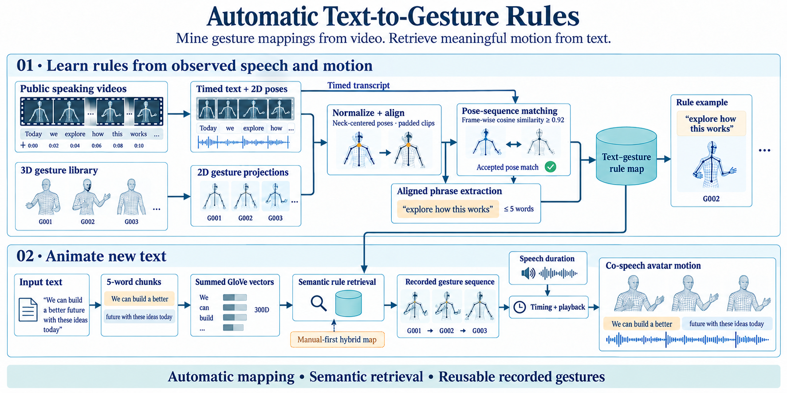

# Automatic text‐to‐gesture rule generation for embodied conversational agents

**Ghazanfar Ali, Myungho Lee, Jae‐In Hwang**

**Computer Animation and Virtual Worlds · 2020** · Published

[Paper / publisher](https://doi.org/10.1002/cav.1944) · [Project page](https://ghazanfarali.com/research/automatic-text-to-gesture/) · [Video presentation](https://www.youtube.com/watch?v=GIxaI9yTmMc) · [BibTeX](citation.bib) · [Requirements](REQUIREMENTS.md) · [Code & setup](#implementation-and-usage)

> Automatically mined rules reduce manual co-speech gesture authoring.



*Graphical abstract diagram. Video-derived rules map new text to recorded co-speech gestures.*

## Why this research

Authoring a large text-to-gesture rule map by hand takes expert effort and can produce repetitive behavior. This work asks whether public videos can supply useful mappings automatically.

The method mines text-to-gesture mappings from public video rather than requiring experts to author every rule. At runtime, word embeddings search for semantically relevant rules and activate recorded gesture units. User evaluation compares mined maps with manual maps and their combination.

## Method at a glance

**Public video + pose** → **Automatic rule mining** → **Semantic gesture retrieval**

| | Research system |
|---|---|
| Input | Offline video and pose; runtime text |
| Method | Automated video-to-rule mapping with semantic word-embedding search |
| Output | Retrieved co-speech gestures |

## Evidence and scope

Comparison with manual rule maps; gesture variety and user perception

**Attribution:** These findings describe the paper or manuscript, not results obtained with this repository's code.

**Study context:** Approximately 106 hours of public video.

**Limitations:** Rule retrieval depends on corpus coverage and the gesture inventory; automatic mapping does not directly decode novel motion.

## Explore the implementation

Timed pose/phrase mining with centered padding and the 0.92 frame-cosine threshold, summed-GloVe retrieval and optional manual rule priority.

This repository contains independently written research code. The institute's original source, datasets and trained models are not distributed. Public-data preparation, commands, assumptions and checks are documented below and in [REQUIREMENTS.md](REQUIREMENTS.md).

## Resources and citation

Read the paper through its [publisher record](https://doi.org/10.1002/cav.1944). PDFs are hosted by publishers or preprint archives rather than stored in this repository.

Watch the [existing YouTube presentation](https://www.youtube.com/watch?v=GIxaI9yTmMc).

Please cite the research paper when using its ideas; [download the BibTeX citation](citation.bib). The implementation has its own documented scope.

## Implementation and usage

<!-- implementation-guide -->

Independent, clean educational implementation of the method in *Automatic text-to-gesture rule generation for embodied conversational agents* (Ali, Lee, and Hwang, 2020, CAVW, DOI: [10.1002/cav.1944](https://doi.org/10.1002/cav.1944)). This is not the institute source code and does not reproduce reported results by itself.

Try the local browser demo after installation: `python scripts/prepare_viewer.py --out static/vendor`, then `python scripts/demo_server.py --example`. Open the printed URL. This mode uses author-created arm motion and transparent illustrative word vectors, labeled in the UI; it exercises the real mining and retrieval functions without claiming a trained model. The prepared-data commands below switch to actual GloVe and motion files.

```bash
python -m pip install -e .
python scripts/prepare_viewer.py --out static/vendor
python scripts/demo_server.py --example
```

The pipeline centers upper-body 2D poses at the neck, slides projected gesture-bank clips over a timed video pose stream, accepts frame-cosine matches at the paper's `0.92` threshold, and records up-to-five-word phrases. Runtime retrieval sums GloVe word vectors for each five-word chunk and selects the most similar stored phrase. An optional `source: manual` entry receives priority on an exact phrase match.

### Setup and public data

```bash
python -m venv .venv
source .venv/bin/activate
python -m pip install -e .
```

On Windows PowerShell, activate with `.\.venv\Scripts\Activate.ps1` instead of the `source` line.

Run the offline verification workflow before preparing a dataset:

```bash
python scripts/verify.py
```

It procedurally creates `outputs/verification/video.npz`, `bank.npz`, and a 300-D GloVe-format fixture, then invokes the installed `mine` and `retrieve` CLI paths. Inspect `rules.jsonl` and `sequence.json` in that directory. Replace those generated files with real arrays using the contracts below; no code path changes are required.

Prepare downloads yourself. Suitable public replacements are the [TED Gesture Dataset](https://github.com/youngwoo-yoon/Co-Speech_Gesture_Generation) for aligned talk pose/text and a redistributable animation library you have rights to use. Download `glove.6B.300d.txt` from the [GloVe project](https://nlp.stanford.edu/projects/glove/). ICT Virtual Human Toolkit animations referenced by the paper are not bundled; check their own access and license terms.

`video.npz` contains `pose: float32[F,J,2]` and scalar `words_json`, a JSON list of `{word,start_frame,end_frame}`. `bank.npz` contains one `[F,J,2]` array per gesture ID. Both must use the same joint order, coordinates, FPS, and neck index 1. Project 3D bank motion into the same camera convention before use.

```bash
attg mine --video data/video.npz --bank data/bank.npz --output outputs/rules.jsonl
attg retrieve --rules outputs/rules.jsonl --glove data/glove.6B.300d.txt \
  --text "we can move forward together today" --audio-seconds 2.8 --output outputs/sequence.json
python -m pytest
```

The rule file records phrase, gesture ID, similarity, frame interval, and source. Retrieval produces ordered gesture slots with semantic score and optional speech timing.

### Prepare and view a motion result

Use a BVH file you have permission to process and a JSONL transcript with either one `{"words":[{"word":"...","start_seconds":0.0,"end_seconds":0.3}]}` record or one word per line. The adapter applies BVH joint rotations, resamples at 15 FPS, centers on the neck, and projects orthographically to XY. It requires the joint names in `scripts/prepare_public_data.py`; retarget other skeletons to those names first. The bank uses consecutive three-second units from the same motion. This illustrates the mining interface; the paper used predefined 3D animations projected against independently estimated video pose.

```bash
python scripts/prepare_public_data.py --bvh data/licensed_motion.bvh --transcript data/words.jsonl --output-dir data/prepared
attg mine --video data/prepared/video.npz --bank data/prepared/bank.npz --output outputs/rules.jsonl
attg retrieve --rules outputs/rules.jsonl --glove data/glove.6B.300d.txt --text "move forward together" --audio-seconds 3 --output outputs/sequence.json
python scripts/export_playback.py --sequence outputs/sequence.json --motion data/prepared/bank.npz --output outputs/playback.json
```

`playback.json` contains selected joint frames, timing and semantic scores. The included `scripts/verify.py` writes a separately labeled procedural verification fixture with illustrative motion and tiny word vectors. It is not a research result.

Install the local 3D viewer dependency and run the live query demo:

```bash
python scripts/prepare_viewer.py --out static/vendor
python scripts/demo_server.py --data-dir data/prepared --glove data/glove.6B.300d.txt
```

Open the printed local URL. The pose-cosine slider re-mines rules at the selected threshold; the trace shows selected gesture IDs and GloVe similarity while the viewer plays the corresponding recorded frames. [Wild pose matching](https://github.com/ghazanPK/wild-pose-matching) is a later research continuation of the automatic mining lineage, not a software dependency.

For a Flow Human integration, export the optional portable rule map:

```bash
python scripts/export_flow_map.py --rules outputs/rules.jsonl --bank data/prepared/bank.npz --glove data/glove.6B.300d.txt --extra-words data/query-vocabulary.txt --output outputs/flow-rule-map.json
```

The JSON contract is `{"rules":[{"phrase":"...","gesture":"...","frames":[...],"fps":15}],"vectors":{"word":[...]}}`. `--extra-words` is optional, one anticipated query word per line; without it only words in rule phrases are exported. An omitted `--glove` leaves out vectors, allowing an importing app to use an explicitly identified lexical baseline. Motion frames come from the bank, not from generated animation.

### Scope and limitations

This repository starts after pose estimation, word alignment, and gesture projection. It does not include videos, motion capture, GloVe, trained weights, Unity assets, or private counts/results. Cosine matching is sensitive to camera and skeleton conventions, GloVe sum pooling is intentionally the paper-era baseline, and retrieval can repeat or select weak semantic matches. Dataset and animation licenses remain separate from this MIT-licensed code.

### Citation

Machine-readable metadata is in [citation.bib](citation.bib).

```bibtex
@article{ali2020automatic, title={Automatic text-to-gesture rule generation for embodied conversational agents}, author={Ali, Ghazanfar and Lee, Myungho and Hwang, Jae-In}, journal={Computer Animation and Virtual Worlds}, volume={31}, number={4-5}, pages={e1944}, year={2020}, doi={10.1002/cav.1944}}
```

### Optional local speech adapters

The viewer can speak its query or transcribe user-selected audio. Browser voice and typed text work without model weights. Install `python -m pip install -e ".[speech]"` for local adapters. Obtain Kokoro files from [Kokoro-82M](https://huggingface.co/hexgrad/Kokoro-82M) yourself: `config.json`, `kokoro-v1_0.pth` and `voices/af_heart.pt`. Set `KOKORO_MODEL_DIR` to their parent folder before launching the server. Follow [Kokoro's English phonemizer setup](https://github.com/hexgrad/kokoro), including espeak-ng where required, then choose Local Kokoro. For ASR, set `WHISPER_MODEL_DIR` to a user-downloaded [faster-whisper](https://github.com/SYSTRAN/faster-whisper) small model directory containing `model.bin` and its tokenizer/configuration files. ASR runs on CPU with INT8, requests word timestamps and VAD, and disables implicit model downloads. No speech model files or audio recordings are included in this repo.

<!-- avatar-recorded-motion:start -->
## Bundled characters and recorded public motion

The browser demos include Rowan and Mira, two new fictional GLB characters built with MPFB and MakeHuman community assets under CC0 1.0. See [avatar licensing and provenance](static/avatars/LICENSE.md). Use the character selector in the stage. The shared renderer supports body bones, ARKit facial channels, and approximate speaking motion.

Recorded motion is adapted to the characters' proportions. Palm landmarks set hand orientation; finger curl uses bounded hinge bends and preserves the character's finger spacing. Distal bends are estimated from the preceding joint when fingertip landmarks are absent. Use the companion's hand close-up views to inspect the result.

The [recorded BEAT motion companion](static/recorded-motion.html) opens at `/recorded-motion.html` while the demo server is running. It plays locally selected motion, face, and WAV files on the bundled characters; this is recorded public-data inspection, separate from the paper implementation. No BEAT recording, dataset archive, or trained model is bundled. Install the one preparation dependency and fetch a small official sample into ignored `outputs/beat-demo/`:

```sh
python -m pip install numpy
python scripts/beat_demo/fetch_modalities.py --speaker 1 --sequence 1_wayne_0_1_1 --include-bvh --max-bytes 25000000 --output-dir outputs/beat-demo/source
python scripts/beat_demo/prepare_bvh.py --bvh outputs/beat-demo/source/1_wayne_0_1_1.bvh --output outputs/beat-demo/sample/1_wayne_0_1_1-raw-motion.json --frames 120
python scripts/beat_demo/prepare_modalities.py --sequence 1_wayne_0_1_1 --source outputs/beat-demo/source --output outputs/beat-demo/sample --frames 120
```

Open the companion and select `outputs/beat-demo/sample/1_wayne_0_1_1-raw-motion.json`, `1_wayne_0_1_1-face.json`, and `1_wayne_0_1_1.wav`. The downloader caps each original file at 25 MB; the prepared clip contains up to 120 frames. The viewer uses local files and does not upload them. For other BEAT takes, substitute a matching official speaker and sequence ID.

If you already have OmniMo's processed 52-joint Unity humanoid data, use that normalized motion instead:

```sh
python scripts/beat_demo/prepare.py --dataset /path/to/processed/beat --speaker 1 --take 1_wayne_0_1_1 --output outputs/beat-demo/sample/1_wayne_0_1_1-motion.json --max-frames 120
```

Select the resulting `*-motion.json` in the companion. Its metadata carries the humanoid joint mapping and source-to-avatar coordinate conversion. The viewer fits source FK directions from the avatar's bind pose, following the spine explicitly at branching joints. This avoids applying incompatible source bone twist to the MPFB skin; it does not reproduce exact performer twist. The adapter supports Unity proximal/intermediate/distal finger names. Raw BVH remains a public-data alternative; do not mix the two skeleton conventions.
<!-- avatar-recorded-motion:end -->
