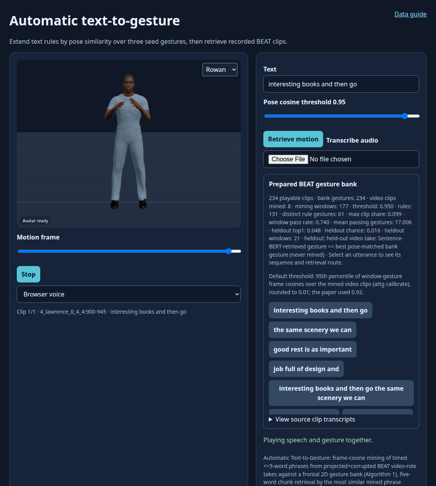

# Automatic text‐to‐gesture rule generation for embodied conversational agents

**Ghazanfar Ali, Myungho Lee, Jae‐In Hwang**

**Computer Animation and Virtual Worlds · 2020** · Published

[Paper / publisher](https://doi.org/10.1002/cav.1944) · [Project page](https://ghazanfarali.com/research/automatic-text-to-gesture/) · [Video presentation](https://www.youtube.com/watch?v=GIxaI9yTmMc) · [BibTeX](citation.bib) · [Requirements](REQUIREMENTS.md) · [Code & setup](#implementation-and-usage)

> Automatically mined rules reduce manual co-speech gesture authoring.


*Graphical abstract diagram. Video-derived rules map new text to recorded co-speech gestures.*

## Why this research

Authoring a large text-to-gesture rule map by hand takes expert effort and can produce repetitive behavior. This work asks whether public videos can supply useful mappings automatically.

The method mines text-to-gesture mappings from public video rather than requiring experts to author every rule. At runtime, word embeddings search for semantically relevant rules and activate recorded gesture units. User evaluation compares mined maps with manual maps and their combination.

## Method at a glance

**Public video + pose** → **Automatic rule mining** → **Semantic gesture retrieval**

| | Research system |
|---|---|
| Input | Offline video and pose; runtime text |
| Method | Automated video-to-rule mapping with semantic word-embedding search |
| Output | Retrieved co-speech gestures |

## Evidence and scope

Comparison with manual rule maps; gesture variety and user perception

**Attribution:** These findings describe the paper or manuscript, not results obtained with this repository's code.

**Study context:** Approximately 106 hours of public video.

**Limitations:** Rule retrieval depends on corpus coverage and the gesture inventory; automatic mapping does not directly decode novel motion.

## Explore the implementation

Timed pose/phrase mining over many clips with a padding-aware frame cosine at the paper's 0.92 threshold and a calibration report, five-word chunk retrieval with Manual, Auto and Hybrid rule maps using all-MiniLM-L6-v2 phrase vectors (a documented substitution for the paper's summed GloVe, which remains optional), and a BEAT route with disjoint library and video speakers.

This repository contains independently written research code. The institute's original source, datasets and trained models are not distributed. Public-data preparation, commands, assumptions and checks are documented below and in [REQUIREMENTS.md](REQUIREMENTS.md).

## Resources and citation

Read the paper through its [publisher record](https://doi.org/10.1002/cav.1944). PDFs are hosted by publishers or preprint archives rather than stored in this repository.

Watch the [existing YouTube presentation](https://www.youtube.com/watch?v=GIxaI9yTmMc).

Please cite the research paper when using its ideas; [download the BibTeX citation](citation.bib). The implementation has its own documented scope.

<!-- demo-preview:start -->
## Demo preview



*The prepared BEAT sequence shows local weak rule association over a fixed three-clip bank. This preview is not a paper benchmark.*

From the repository root, using the Python environment described below:

```sh
python -m pip install -e .
python -m pip install -r scripts/requirements-demo.txt
python scripts/start_demo.py
```

Open **http://127.0.0.1:8080/**. On first launch, the script downloads a small official BEAT BVH/TextGrid sample (four takes, about 80 MB), builds a local nine-clip source bank, then makes this method's three-clip playback bank in ignored `outputs/`. It mines the paired association windows with the padding-aware frame cosine at a percentile-calibrated threshold (Algorithm 1) and retrieves through the hybrid manual/auto map over five-word chunks. Phrase and chunk vectors come from all-MiniLM-L6-v2, a documented substitution for the paper's summed GloVe vectors; the launcher downloads it once (about 92 MB) into ignored `models/`, and `--offline` skips it. Text with no in-vocabulary word plays an explicit idle slot. Choose a suggested utterance to inspect its clip IDs and rule route, then click **Play speech + gesture**. The aligned text places clips during speech; Stop cancels speech, and scrubbing previews a pose. The first launch also downloads pinned Three.js modules. Public recordings and fitted artifacts stay local and are not bundled.

The 3D presentation uses shared Three.js avatar components and bundled fictional CC0 characters. The paper-specific algorithms and data adapters live in this repository.

**Paper method on BEAT.** When a BEAT source is configured (`BEAT_PROCESSED_ROOT` for a processed collection, `BEAT_RAW_ROOT` for raw `beat_english_v0.2.1` BVH/TextGrid, or a copy under `data/beat/`) and the Sentence-BERT model is available (`models/all-MiniLM-L6-v2`, downloaded on first run, or `BEAT_SBERT_MODEL`/`SBERT_MODEL`); the paper's GloVe vectors remain an optional alternative (`--encoder glove`), `scripts/start_demo.py` first runs `scripts/prepare_paper_method.py`, which trains or mines with this repository's own pipeline on disjoint BEAT speakers and caches the result under ignored `outputs/paper-method/`. The same viewer then serves that prepared method with its library and suggested queries. Without the data the launcher serves the small demo adapter above; `--skip-paper-method` forces it. See [Reproduce with BEAT](#reproduce-with-beat).

To replace the demo motion with an existing processed BEAT take, run `python scripts/prepare_beat_demo.py --processed /path/to/processed/beat`, then restart the server. Use `--rebuild --epochs 80` to regenerate the public sample and refit the small adapter. For a larger bank, the documented full-data CLI below retains the paper-specific input contracts.

<!-- demo-preview:end -->

## Implementation and usage

<!-- implementation-guide -->

Independent, clean educational implementation of the method in *Automatic text-to-gesture rule generation for embodied conversational agents* (Ali, Lee, and Hwang, 2020, CAVW, DOI: [10.1002/cav.1944](https://doi.org/10.1002/cav.1944)). This is not the institute source code and does not reproduce reported results by itself.

The default browser path is the prepared BEAT demo above. For an offline algorithm fixture, `python scripts/demo_server.py --example` still serves author-created arm motion and illustrative word vectors after viewer preparation. It exercises mining and retrieval functions without fitting a model; use the prepared-data commands below for the original CLI contracts.

```bash
python -m pip install -e .
python scripts/prepare_viewer.py --out static/vendor
python scripts/demo_server.py --example
```

The pipeline centers upper-body 2D poses at the neck, slides projected gesture-bank clips over a timed video pose stream, accepts frame-cosine matches at the paper's `0.92` threshold, and records up-to-five-word phrases. The frame-cosine mean covers only the gesture's real frames, so a short gesture centre-padded into a longer window can still match. Mining loops over any number of video clips (Algorithm 1's outer loop) and writes a threshold-calibration report. Runtime retrieval encodes each five-word chunk and every stored phrase and selects the most similar stored phrase by cosine; slot timing divides the audio duration over the chunks. Phrase vectors come from all-MiniLM-L6-v2 by default, in place of the paper's summed GloVe vectors, which remain optional (see [Text encoder](#text-encoder-minilm-substitution)). The paper's three maps are available: Manual (NVBG-style keyword rules), Auto (mined rules) and Hybrid (manual keyword match first, phrase vectors otherwise). The browser's local BEAT index is a compact simulation of weak association over a fixed bank; [Wild Pose Matching](https://github.com/ghazanPK/wild-pose-matching) later replaces this mean pose match with learned matching.

### Text encoder: MiniLM substitution

The paper sums 300-D GloVe word vectors into a phrase vector. This implementation uses the Sentence-BERT model [all-MiniLM-L6-v2](https://huggingface.co/sentence-transformers/all-MiniLM-L6-v2) instead, and keeps GloVe as an optional alternative.

- **Unchanged.** Algorithm 2 keeps its structure: fixed five-word chunks (a shorter remainder is dropped), the stored rule phrase with the highest cosine, slot timing that divides the audio duration evenly over the chunks, and the Manual, Auto and Hybrid maps.
- **Changed.** Only the phrase vector differs: MiniLM encodes the whole chunk or rule phrase instead of summing word vectors. A chunk with no whole word in the model's vocabulary is out of vocabulary and plays idle, as a chunk without GloVe words does. Similarity values therefore differ from GloVe values.
- **Why.** The GloVe 6B archive is an 820 MB download. MiniLM is about 92 MB (Apache-2.0), and the other gesture repositories already use it (owner decision, 6 October 2026).
- **Download.** `python scripts/start_demo.py` downloads it once into ignored `models/all-MiniLM-L6-v2` from a pinned Hugging Face revision and reuses it afterwards. `python scripts/beat_demo/fetch_models.py` does the same on its own. `--offline` or `PAPERREACH_OFFLINE=1` skips the download, and a failed download is reported without stopping the demo. Models are never committed.
- **Lookup order.** `--sbert`, then `BEAT_SBERT_MODEL`, then `SBERT_MODEL`, then `models/all-MiniLM-L6-v2`. `attg retrieve` looks for `models/` in the working directory.
- **GloVe (optional).** Download `glove.6B.zip` from the [GloVe project](https://nlp.stanford.edu/projects/glove/) and extract `glove.6B.300d.txt` into `data/glove/`. Then pass `attg retrieve --glove FILE`, `scripts/prepare_paper_method.py --encoder glove` (or `--glove FILE`), or `scripts/demo_server.py --glove FILE`. `scripts/build_glove_subset.py` cuts the file to the 20,000 most frequent words plus every word spoken in your BEAT copy. The shared browser demo uses GloVe when `BEAT_GLOVE_PATH` or `GLOVE_PATH` names a file.

### Reproduce with BEAT

`scripts/prepare_paper_method.py` runs this repository's full pipeline on public [BEAT](https://pantomatrix.github.io/BEAT/) motion, then serves the result in the browser viewer. Disjoint speakers take the paper's two roles:

| Role | Default speakers | Used for |
|---|---|---|
| `library` | 3 | 3 s neck-centred windows projected frontally to 2D. They form the gesture bank, standing in for the paper's predefined animation library. |
| `video` | 3 | Whole takes with their word timings stand in for public video. Each take is projected through a camera at yaw 20° and pitch 5°, then corrupted like OpenPose tracks: noise, ±1-frame jitter and 5% joint dropout. `attg mine` slides the bank over every clip (Algorithm 1). The last video take is held out of mining as a probe. |

Roles are assigned per speaker with a fixed `--seed`. `--role library=1,2 --role video=rest` overrides them.

**1. Text encoder.** Retrieval (Algorithm 2) uses all-MiniLM-L6-v2 from `models/all-MiniLM-L6-v2`, which `scripts/start_demo.py` downloads on first run (or run `python scripts/beat_demo/fetch_models.py`). `--sbert DIR` selects another local model. For the paper's GloVe instead, pass `--encoder glove`: the hook then uses `data/glove/glove.6B.300d.subset.txt`, then `data/glove/glove.6B.300d.txt`, and `--glove FILE` or the `GLOVE_PATH` environment variable selects another file. Optionally, cut GloVe down first:

```bash
python scripts/build_glove_subset.py --glove data/glove/glove.6B.300d.txt --vocab-from /path/to/processed/beat \
  --output data/glove/glove.6B.300d.subset.txt
```

**2a. Processed OmniMo collection.** The collection is laid out as `<root>/<speaker>/{meta.json,motion.npz}`:

```bash
python scripts/prepare_paper_method.py --processed /path/to/processed/beat
python scripts/demo_server.py --prepared outputs/paper-method/<key> --port 8080
```

The last line of standard output is JSON whose `server_args` give the exact prepared folder.

**2b. Raw BEAT from Hugging Face.** Download BVH and TextGrid pairs from the official dataset [`H-Liu1997/BEAT`](https://huggingface.co/datasets/H-Liu1997/BEAT) into `data/beat/beat_english_v0.2.1/<speaker>/`. Each BVH is about 20 MB:

```bash
base=https://huggingface.co/datasets/H-Liu1997/BEAT/resolve/main/beat_english_v0.2.1/beat_english_v0.2.1
for take in 1_wayne_0_1_1 1_wayne_0_2_2 2_scott_0_1_1 2_scott_0_2_2 3_solomon_0_3_3 3_solomon_0_4_4 \
            4_lawrence_0_2_2 4_lawrence_0_3_3 5_stewart_0_1_1 5_stewart_0_2_2 6_carla_0_2_2 6_carla_0_3_3; do
  spk=${take%%_*}; mkdir -p data/beat/beat_english_v0.2.1/$spk
  for ext in bvh TextGrid; do curl -fL -o data/beat/beat_english_v0.2.1/$spk/$take.$ext $base/$spk/$take.$ext; done
done
python scripts/prepare_paper_method.py --beat-root data/beat/beat_english_v0.2.1
```

**Launcher.** `python scripts/start_demo.py` runs this hook after the shared BEAT demo preparation.
- **Source.** It looks in `--processed` or `--beat-root`, then `BEAT_PROCESSED_ROOT` or `BEAT_RAW_ROOT`, then `data/beat/processed` or `data/beat/beat_english_v0.2.1`.
- **Missing input.** Without a source or text encoder, it prints the next step and the default demo starts unchanged.
- **Cache.** Results are cached in ignored `outputs/paper-method/<settings hash>/`. A repeat launch with the same settings returns at once; `--force` rebuilds.

**Threshold.** On projected BEAT poses, the paper's 0.92 sits near the median window–gesture frame cosine. Most of the bank would then pass most windows, so the random pick would make rules arbitrary. `--preset demo` (the default) therefore runs `attg calibrate` and mines at the 95th percentile of the window–gesture scores, rounded to 0.01; `--threshold-percentile` changes it. `--preset paper`, or an explicit `--threshold`, mines at that value. The viewer's slider starts at the prepared threshold. Moving it re-mines the prepared video clips before retrieval.

**Demo scale.** The default uses speakers 1–6 with up to three takes each, and takes seconds on a CPU. One local run on the processed collection mined 131 rules over 61 of 234 bank gestures at threshold 0.95, from 177 windows in eight video takes. For more data, use `--speakers all --max-takes-per-speaker 0`.

**Viewer.**
- `/api/beat-library` lists the bank clips, the calibration metrics and the default threshold. Its suggested queries include mined rule phrases and held-out probes, which are phrases from the held-out video take.
- `/api/beat-query` returns each five-word chunk's bank frames with route `mined_pose_rule`, its text similarity and the matched rule phrase; `text_encoder` names the encoder. A chunk without an in-vocabulary word, or below an optional `min_similarity`, returns `idle_no_match`.
- The stored held-out metric asks how often text retrieval of a held-out phrase picks the bank gesture that its pose matches best. Chance is one over the number of distinct rule gestures.

**Limits.** Projected BEAT motion stands in for the paper's 106 hours of public video and its separately animated library; it is not the paper's data. At demo scale the mined map covers few words, and text–gesture agreement on held-out phrases is only modestly above chance.

### Setup and public data

```bash
python -m venv .venv
source .venv/bin/activate
python -m pip install -e .
```

On Windows PowerShell, activate with `.\.venv\Scripts\Activate.ps1` instead of the `source` line.

Run the offline verification workflow before preparing a dataset:

```bash
python scripts/verify.py
```

It procedurally creates two clips (`clip_a.npz`, `clip_b.npz`), a variable-length `bank.npz` and a 300-D GloVe-format fixture. It then runs the installed CLI: `mine` over both clips at `0.92`, `import-manual` on the authored `examples/manual_map_nvbg.xml`, and `retrieve` with each of `--map auto|manual|hybrid` on the GloVe fixture. When `models/all-MiniLM-L6-v2` exists, it also runs `retrieve --sbert` and checks that the first chunk selects the `move forward` rule; otherwise it reports that check as skipped. Inspect `rules.jsonl`, `rules.jsonl.calibration.json` and `sequence-*.json` in that directory. Replace those generated files with real arrays using the contracts below; no code path changes are required.

Prepare downloads yourself. Suitable public replacements are the [TED Gesture Dataset](https://github.com/youngwoo-yoon/Co-Speech_Gesture_Generation) for aligned talk pose/text and a redistributable animation library you have rights to use. The default text encoder is downloaded by `scripts/start_demo.py` or `scripts/beat_demo/fetch_models.py`; GloVe is optional (see [Text encoder](#text-encoder-minilm-substitution)). ICT Virtual Human Toolkit animations referenced by the paper are not bundled; check their own access and license terms.

Each video NPZ contains `pose: float32[F,J,2]`, a scalar `words_json` (a JSON list of `{word,start_frame,end_frame}`) and an optional scalar `clip_id`. `bank.npz` contains one `[F,J,2]` array per gesture ID; gestures may differ in length. All files must use the same joint order, coordinates, FPS, and neck index (default 1). Project 3D bank motion into the same camera convention before use.

```bash
attg mine --video data/clip_001.npz data/clip_002.npz --bank data/bank.npz --output outputs/rules.jsonl
attg mine --manifest data/clips.txt --bank data/bank.npz --threshold-percentile 95 --output outputs/rules.jsonl
attg calibrate --manifest data/clips.txt --bank data/bank.npz --output outputs/calibration.json
attg retrieve --rules outputs/rules.jsonl \
  --text "we can move forward together today" --audio-seconds 2.8 --output outputs/sequence.json
attg retrieve --rules outputs/rules.jsonl --glove data/glove/glove.6B.300d.txt \
  --text "we can move forward together today" --output outputs/sequence-glove.json   # optional GloVe
attg import-manual --input my_nvbg_rules.xml --output data/manual_map.json
attg retrieve --map hybrid --manual data/manual_map.json --rules outputs/rules.jsonl \
  --text "we will never give up on this" --output outputs/sequence.json
attg config
python -m pytest
```

- **Mining.** `--video` accepts several files and repeats. `--manifest` lists one NPZ per line, or a JSON list. Rule `source` is the clip ID (made unique), plus the frame interval. The stride is the longest bank gesture.
- **Calibration report.** `mine` saves it to `<output>.calibration.json` and prints a summary. It covers score percentiles, and per-threshold window pass rate and bank pass fraction. It warns when most of the bank passes most windows, which makes the random pick arbitrary. `--threshold-percentile P` sets the threshold to the P-th percentile of all window-by-gesture scores instead of `0.92`.
- **Manual map.** The format is JSON `{"format":"attg-manual-map/1","rules":[{"keyword","patterns":[...],"gestures":[...],"priority"}]}`; see [examples/manual_map.json](examples/manual_map.json). `import-manual` converts an NVBG-like XML table (`<rule keyword priority><pattern/>…<animation/></rule>`) or a CSV table (`keyword,patterns,gestures,priority`, with `|` between items). Gesture IDs must exist in your bank; the fixture's IDs match the `verify.py` bank.
- **Map modes.** A manual rule matches when one of its patterns appears as contiguous words in the chunk. Higher priority wins, then the longer pattern; one of the rule's gestures is picked at random. `--map manual` sends unmatched chunks to idle. `--map hybrid` tries the manual map first, then the phrase vectors. `--map auto` uses the phrase vectors only.
- **Idle slots.** A chunk with no in-vocabulary word, or below the optional `--min-similarity`, becomes an idle slot (`--idle-id`, default `idle`). `--oov skip` drops it instead, and `--oov error` restores the old exception.
- **Defaults.** `attg config` prints them: threshold, phrase length, chunk size, neck joint, seed and OOV policy. A JSON file passed with `--config` overrides them.

The rule file records phrase, gesture ID, similarity, frame interval, and source. Retrieval produces ordered gesture slots with route (`manual`, `auto` or `idle`), semantic score and optional speech timing.

### Prepare and view a motion result

Use a BVH file you have permission to process and a JSONL transcript with either one `{"words":[{"word":"...","start_seconds":0.0,"end_seconds":0.3}]}` record or one word per line. The adapter applies BVH joint rotations, resamples at 15 FPS, centers on the neck, and projects orthographically to XY. It requires the joint names in `scripts/prepare_public_data.py`; retarget other skeletons to those names first. The bank uses consecutive three-second units from the same motion. This illustrates the mining interface; the paper used predefined 3D animations projected against independently estimated video pose.

```bash
python scripts/prepare_public_data.py --bvh data/licensed_motion.bvh --transcript data/words.jsonl --output-dir data/prepared
attg mine --video data/prepared/video.npz --bank data/prepared/bank.npz --output outputs/rules.jsonl
attg retrieve --rules outputs/rules.jsonl --text "move forward together" --audio-seconds 3 --output outputs/sequence.json
python scripts/export_playback.py --sequence outputs/sequence.json --motion data/prepared/bank.npz --output outputs/playback.json
```

`playback.json` contains selected joint frames, timing and semantic scores. Idle slots are left out, so the renderer holds its rest pose for them. The included `scripts/verify.py` writes a separately labeled procedural verification fixture with illustrative motion and tiny word vectors. It is not a research result.

Install the local 3D viewer dependency and run the live query demo:

```bash
python scripts/prepare_viewer.py --out static/vendor
python scripts/demo_server.py --data-dir data/prepared   # add --glove FILE for the paper's GloVe
```

Open the printed local URL. The pose-cosine slider re-mines rules at the selected threshold; the trace shows selected gesture IDs and text similarity while the viewer plays the corresponding recorded frames. [Wild pose matching](https://github.com/ghazanPK/wild-pose-matching) is a later research continuation of the automatic mining lineage, not a software dependency.

For a Flow Human integration, export the optional portable rule map:

```bash
python scripts/export_flow_map.py --rules outputs/rules.jsonl --bank data/prepared/bank.npz --glove data/glove/glove.6B.300d.txt --extra-words data/query-vocabulary.txt --output outputs/flow-rule-map.json
```

The JSON contract is `{"rules":[{"phrase":"...","gesture":"...","frames":[...],"fps":15}],"vectors":{"word":[...]}}`. `--extra-words` is optional, one anticipated query word per line; without it only words in rule phrases are exported. `--glove` is optional; an omitted `--glove` leaves out vectors, and Flow Human then matches the exported phrases with its own Sentence-BERT (all-MiniLM-L6-v2) or an explicitly identified lexical baseline. Motion frames come from the bank, not from generated animation.

### Scope and limitations

This repository starts after pose estimation, word alignment, and gesture projection. It does not include videos, motion capture, word vectors, text-encoder or trained weights, Unity assets, or private counts/results; the MiniLM text encoder is downloaded on first run. Cosine matching is sensitive to camera and skeleton conventions. MiniLM phrase vectors replace the paper-era GloVe sum pooling, so similarity values differ from the paper's, and retrieval can repeat or select weak semantic matches. Dataset and animation licenses remain separate from this MIT-licensed code (see [LICENSE](LICENSE)).

### Citation

Machine-readable metadata is in [citation.bib](citation.bib).

```bibtex
@article{ali2020automatic, title={Automatic text-to-gesture rule generation for embodied conversational agents}, author={Ali, Ghazanfar and Lee, Myungho and Hwang, Jae-In}, journal={Computer Animation and Virtual Worlds}, volume={31}, number={4-5}, pages={e1944}, year={2020}, doi={10.1002/cav.1944}}
```

### Optional local speech adapters

The viewer can speak its query or transcribe user-selected audio. Browser voice and typed text work without model weights. Install `python -m pip install -e ".[speech]"` for local adapters. Obtain Kokoro files from [Kokoro-82M](https://huggingface.co/hexgrad/Kokoro-82M) yourself: `config.json`, `kokoro-v1_0.pth` and `voices/af_heart.pt`. Set `KOKORO_MODEL_DIR` to their parent folder before launching the server. Follow [Kokoro's English phonemizer setup](https://github.com/hexgrad/kokoro), including espeak-ng where required, then choose Local Kokoro. For ASR, set `WHISPER_MODEL_DIR` to a user-downloaded [faster-whisper](https://github.com/SYSTRAN/faster-whisper) small model directory containing `model.bin` and its tokenizer/configuration files. ASR runs on CPU with INT8, requests word timestamps and VAD, and disables implicit model downloads. No speech model files or audio recordings are included in this repo.

<!-- avatar-recorded-motion:start -->
## Bundled characters and recorded public motion

The browser demos include Rowan and Mira, two new fictional GLB characters built with MPFB and MakeHuman community assets under CC0 1.0. See [avatar licensing and provenance](static/avatars/LICENSE.md). Use the character selector in the stage. The shared renderer supports body bones, ARKit facial channels, and approximate speaking motion.

Recorded motion is adapted to the characters' proportions. Palm landmarks set hand orientation; finger curl uses bounded hinge bends and preserves the character's finger spacing. Thumb-base opposition stays in the authored pose, with conservative recorded curl at the remaining joints. Distal bends are estimated from the preceding joint when fingertip landmarks are absent. Use the companion's hand close-up views to inspect the result.

The [avatar motion companion](static/recorded-motion.html) opens at `/recorded-motion.html` while the demo server is running. A small authored motion and face sample loads automatically; click **Play** without uploading files. It also plays locally selected BEAT motion, face, and WAV files on the bundled characters. These are presentation and data-inspection tools, separate from the paper implementation. No BEAT recording, dataset archive, or trained model is bundled. For recorded public motion, install the one preparation dependency and fetch a small official sample into ignored `outputs/beat-demo/`:

```sh
python -m pip install numpy
python scripts/beat_demo/fetch_modalities.py --speaker 1 --sequence 1_wayne_0_1_1 --include-bvh --max-bytes 25000000 --output-dir outputs/beat-demo/source
python scripts/beat_demo/prepare_bvh.py --bvh outputs/beat-demo/source/1_wayne_0_1_1.bvh --output outputs/beat-demo/sample/1_wayne_0_1_1-raw-motion.json --frames 120
python scripts/beat_demo/prepare_modalities.py --sequence 1_wayne_0_1_1 --source outputs/beat-demo/source --output outputs/beat-demo/sample --frames 120
```

Open the companion and select `outputs/beat-demo/sample/1_wayne_0_1_1-raw-motion.json`, `1_wayne_0_1_1-face.json`, and `1_wayne_0_1_1.wav`. The downloader caps each original file at 25 MB; the prepared clip contains up to 120 frames. The viewer uses local files and does not upload them. For other BEAT takes, substitute a matching official speaker and sequence ID.

If you already have OmniMo's processed 52-joint Unity humanoid data, use that normalized motion instead:

```sh
python scripts/beat_demo/prepare.py --dataset /path/to/processed/beat --speaker 1 --take 1_wayne_0_1_1 --output outputs/beat-demo/sample/1_wayne_0_1_1-motion.json --max-frames 120
```

Select the resulting `*-motion.json` in the companion. Its metadata carries the humanoid joint mapping and source-to-avatar coordinate conversion. The viewer fits source FK directions from the avatar's bind pose, following the spine explicitly at branching joints. This avoids applying incompatible source bone twist to the MPFB skin; it does not reproduce exact performer twist. The adapter supports Unity proximal/intermediate/distal finger names. Raw BVH remains a public-data alternative; do not mix the two skeleton conventions.
<!-- avatar-recorded-motion:end -->
