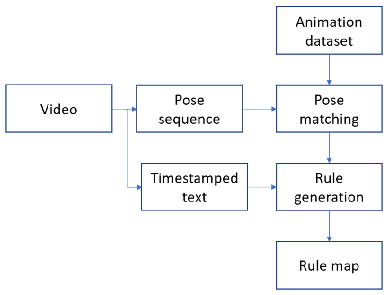

# Automatic text‐to‐gesture rule generation for embodied conversational agents

**Ghazanfar Ali, Myungho Lee, Jae‐In Hwang**

**Computer Animation and Virtual Worlds · 2020** · Published

[Paper / publisher](https://doi.org/10.1002/cav.1944) · [Project page](https://ghazanfarali.com/research/automatic-text-to-gesture/) · [Video presentation](https://www.youtube.com/watch?v=GIxaI9yTmMc) · [BibTeX](citation.bib) · [Requirements](REQUIREMENTS.md) · [Code & setup](#implementation-and-usage)

> Automatically mined rules reduce manual co-speech gesture authoring.



*Original method figure from the paper: Figure 1, PDF page 2. Extracted for this research introduction; the diagram describes the original system, not verification of this reimplementation.*

## Why this research

Authoring a large text-to-gesture rule map by hand takes expert effort and can produce repetitive behavior. This work asks whether public videos can supply useful mappings automatically.

The method mines text-to-gesture mappings from public video rather than requiring experts to author every rule. At runtime, word embeddings search for semantically relevant rules and activate recorded gesture units. User evaluation compares mined maps with manual maps and their combination.

## Method at a glance

**Public video + pose** → **Automatic rule mining** → **Semantic gesture retrieval**

| | Research system |
|---|---|
| Input | Offline video and pose; runtime text |
| Method | Automated video-to-rule mapping with semantic word-embedding search |
| Output | Retrieved co-speech gestures |

## Evidence and scope

Comparison with manual rule maps; gesture variety and user perception

**Attribution:** These findings describe the paper or manuscript, not results obtained with this repository's code.

**Study context:** Approximately 106 hours of public video.

**Limitations:** Rule retrieval depends on corpus coverage and the gesture inventory; automatic mapping does not directly decode novel motion.

## Explore the implementation

Timed pose/phrase mining with centered padding and the 0.92 frame-cosine threshold, summed-GloVe retrieval and optional manual rule priority.

This repository contains independently written research code. The institute's original source, datasets and trained models are not distributed. Public-data preparation, commands, assumptions and checks are documented below and in [REQUIREMENTS.md](REQUIREMENTS.md).

## Resources and citation

Read the paper through its [publisher record](https://doi.org/10.1002/cav.1944). PDFs are hosted by publishers or preprint archives rather than stored in this repository.

Watch the [existing YouTube presentation](https://www.youtube.com/watch?v=GIxaI9yTmMc).

Please cite the research paper when using its ideas; [download the BibTeX citation](citation.bib). The implementation has its own documented scope.

## Implementation and usage

<!-- implementation-guide -->

Independent, clean educational implementation of the method in *Automatic text-to-gesture rule generation for embodied conversational agents* (Ali, Lee, and Hwang, 2020, CAVW, DOI: [10.1002/cav.1944](https://doi.org/10.1002/cav.1944)). This is not the institute source code and does not reproduce reported results by itself.

The pipeline centers upper-body 2D poses at the neck, slides projected gesture-bank clips over a timed video pose stream, accepts frame-cosine matches at the paper's `0.92` threshold, and records up-to-five-word phrases. Runtime retrieval sums GloVe word vectors for each five-word chunk and selects the most similar stored phrase. An optional `source: manual` entry receives priority on an exact phrase match.

### Setup and public data

```bash
python -m venv .venv
source .venv/bin/activate
python -m pip install -e .
```

On Windows PowerShell, activate with `.\.venv\Scripts\Activate.ps1` instead of the `source` line.

Run the offline smoke workflow before preparing a dataset:

```bash
python scripts/smoke.py
```

It procedurally creates `outputs/smoke/video.npz`, `bank.npz`, and a 300-D GloVe-format fixture, then invokes the installed `mine` and `retrieve` CLI paths. Inspect `rules.jsonl` and `sequence.json` in that directory. Replace those generated files with real arrays using the contracts below; no code path changes are required.

Prepare downloads yourself. Suitable public replacements are the [TED Gesture Dataset](https://github.com/youngwoo-yoon/Co-Speech_Gesture_Generation) for aligned talk pose/text and a redistributable animation library you have rights to use. Download `glove.6B.300d.txt` from the [GloVe project](https://nlp.stanford.edu/projects/glove/). ICT Virtual Human Toolkit animations referenced by the paper are not bundled; check their own access and license terms.

`video.npz` contains `pose: float32[F,J,2]` and scalar `words_json`, a JSON list of `{word,start_frame,end_frame}`. `bank.npz` contains one `[F,J,2]` array per gesture ID. Both must use the same joint order, coordinates, FPS, and neck index 1. Project 3D bank motion into the same camera convention before use.

```bash
attg mine --video data/video.npz --bank data/bank.npz --output outputs/rules.jsonl
attg retrieve --rules outputs/rules.jsonl --glove data/glove.6B.300d.txt \
  --text "we can move forward together today" --audio-seconds 2.8 --output outputs/sequence.json
python -m pytest
```

The rule file records phrase, gesture ID, similarity, frame interval, and source. Retrieval produces ordered gesture slots with semantic score and optional speech timing.

### Scope and limitations

This repository starts after pose estimation, word alignment, and gesture projection. It does not include videos, motion capture, GloVe, trained weights, Unity assets, or private counts/results. Cosine matching is sensitive to camera and skeleton conventions, GloVe sum pooling is intentionally the paper-era baseline, and retrieval can repeat or select weak semantic matches. Dataset and animation licenses remain separate from this MIT-licensed code.

### Citation

Machine-readable metadata is in [citation.bib](citation.bib).

```bibtex
@article{ali2020automatic, title={Automatic text-to-gesture rule generation for embodied conversational agents}, author={Ali, Ghazanfar and Lee, Myungho and Hwang, Jae-In}, journal={Computer Animation and Virtual Worlds}, volume={31}, number={4-5}, pages={e1944}, year={2020}, doi={10.1002/cav.1944}}
```
